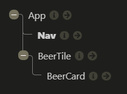
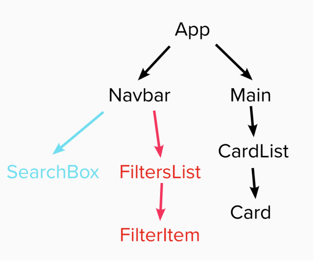
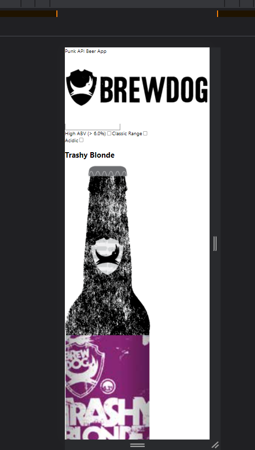

# Feedback

Right click on the file and click Open Preview or `ctrl/cmd + shift + v` to open preview

## Goals

1. Working beers web app - done
2. Practice using API and React - done
3. Application of what you're learning (React, Fetch etc.) - done

## Specification

### Start

> "All the wire frame content in black is the first part of the challenge - that is, the nav, the main section containing the beers and beer cards for each piece of data."



Your component tree looks good, it doesn't match the component tree in the brief though. The brief component tree has more components in it, this is done on purpose to give you practice making components and passing props.



In a application this size there probably are to many components but it is good practice so why not give it a go?

Try adding in these components:

- `<Main/>`
- `<SearchBox/>`
- `<FiltersList/>`
- `<FilterItem/>`

It may seem like overkill but it will give you good practice with props etc.

When you are building things in React have a go at breaking your project into a component tree before you go in with the code. It will help you out manage all of the moving pieces and pages.

### Extension 1

> "Once you've got the design and layout sorted to render the elements, it's time to add some search functionality. Make it so you can search the beers by their name, and the page content should update as you type each letter in the box."

The aim of this extension is to get you using functions as props. You have done it, the functions in your app is being passed to multiple components. The component that gets the function is capturing the user input and passing it back up to the app. This is similar with your filter functions.

This is great and functions as props is slightly strange to get your head around. By doing this you have made your `<Nav/>` more reuseable and made the beers data usable throughout the whole of you application.

It doesn't get passed multiple levels so do the points mentioned in the notes above and have a go at passing it through multiple levels. It is all about practicing props and passing your functions around.

### Extension 2

> Finally attempt to make it so you can filter the content on three conditions:
>
> > - High Alcohol (ABV value greater than 6%)
> > - Classic Range (Was first brewed before 2010)
> > - High Acidity (pH lower than 4)
> > - If you can’t achieve this after a good attempt, then feel free to move on to the final extension.

Nice going with this you have got each of the individual filters to work so kudos for that. I like the way you have broken it down and solved each individual filter.

What we need o look at is how we can tie all of them together. You are really close to doing it. You will just need to alter your url based abv, classic and searchTerm states.

```jsx
// 76 - 100 - App.jsx
let url = "https://api.punkapi.com/v2/beers";

if (abv === true) {
  url = "https://api.punkapi.com/v2/beers?abv_gt=6";
}

if (classic === true) {
  url = "https://api.punkapi.com/v2/beers?brewed_before=12-2010";
}

if (searchTerm) {
  url = `https://api.punkapi.com/v2/beers?beer_name=${searchTerm}`;
}
```

Instead of redefining the url each time why not just append the params it needs? that is the only thing changing. This way you can combine multiple params.

The code above could be.

```jsx
let url = "https://api.punkapi.com/v2/beers?";
// abv is a boolean so you do not need === true
if (abv) {
  url += "abv_gt=6";
  // to url I will add on ^^
}

if (classic) {
  url += "&brewed_before=12-2010";
}

if (searchTerm) {
  url += `&beer_name=${searchTerm}`;
}

// If all of the conditions above are true a url could look like this.
// https://api.punkapi.com/v2/beers?abv_gt=6&brewed_before=12-2010&beer_name=dev
```

On a side note you could refactor your toggle handlers. You want the code to be readable so don't feel that you have to.

```jsx
const handleClassic = () => setClassic(!classic);
```

### Extension 3

> Style the website however you see fit! Go wild!

It looks great I think this is you most polished project so far. The classes are named with B.E.M and it works on most view-ports.

There is a slight bug you will need to look into.



When it goes below a certain width no styles are being applied. This is a easy fix.

```scss
@media (min-device-width: 320px) {
  // These style can just be applied by default
}

// The other styles can be applied when they need to.
```

---

## Overall

The components you have made are good and do make sense for an application this size.

You have multiple functions being passed across your application. These functions are making the filter functionality work this is great!

I feel confident with your understanding of useState, useEffect and funcs as props.

Awesome mate good going! I can't wait to see what you build next.

## To work on

Address the points above.

It looks like you have ran compile hero at some point. You shouldn't need to use in your React project. I would go through and remove the dist folders in each of your components folders.

Update the readme.md so it is not the auto generated file.

App is a little messy but you can easily tidy it up.

- Remove the `console.log()`
- Remove any commented out code.

I think if you address the above, and refactor the filter and append the search term to the request. App.jsx will be perfect.

Final notes, when you run a react app, your terminal shows you warnings. These are generally easily googleable and simple to fix and will improve code quality. So always keep one eye on your terminal while coding in react.
